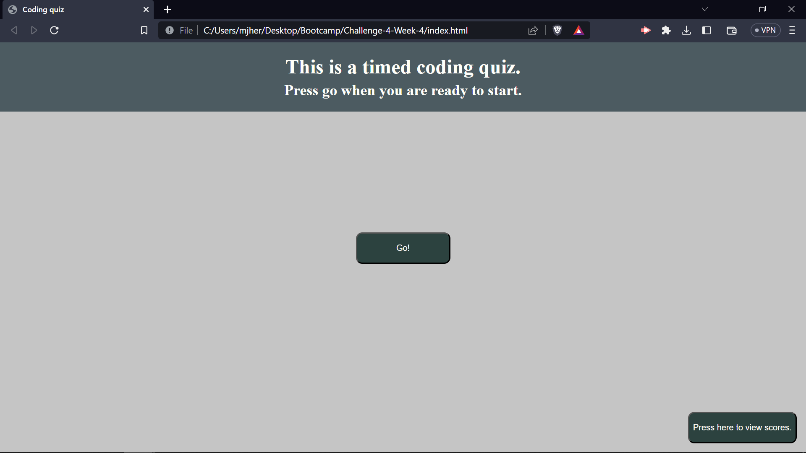
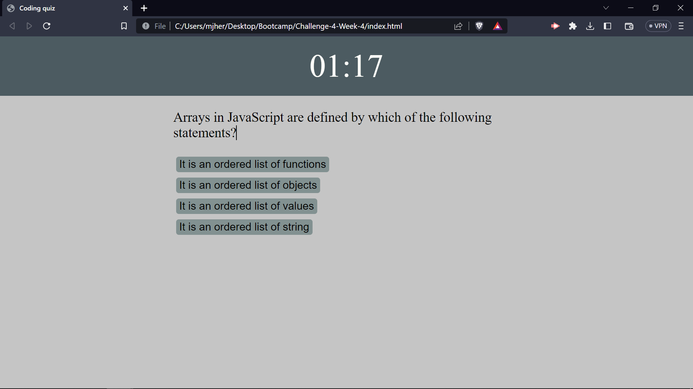

# Challenge-4-Week-4
Repository for challenge 4 week 4 for bootcamp

## Objective
the objective was to create a website with a coding quiz on it, that would record store and display scores.

there should be a timer, start button, and highscores button.

## Links
github pages
https://shyguymatt.github.io/Challenge-4-Week-4/

github repository
https://github.com/shyguyMatt/Challenge-4-Week-4

## Screenshots

